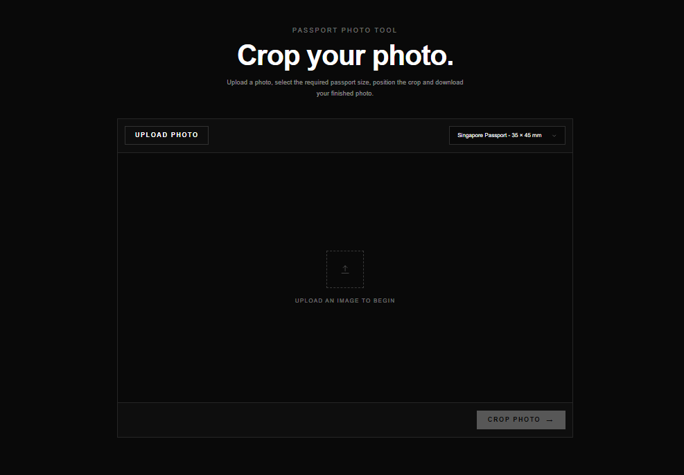

# Passport-Cropper

This repository contains a web-based passport photo cropping tool. It allows users to upload an image, select a passport photo size, adjust the crop area, and download the finished photo.

## Scenario

Passport Cropper is a simple browser-based utility designed to make passport photo preparation easier. Users can upload an existing image, select the required passport photo size, position and adjust the crop area, and download the resulting image.

The application runs entirely in the browser and provides a responsive interface that can be used on both desktop and mobile devices.

## Features

* Upload JPG, PNG, and WebP images
* Select from available passport photo sizes
* Interactive image cropping
* Preview the selected crop area
* Crop the uploaded image
* Download the cropped photo
* Light / dark mode
* Responsive design for desktop and mobile devices

## Technology Used

* **React** – Front-end user interface
* **TypeScript** – Type-safe JavaScript development
* **Vite** – Development server and build tool
* **Tailwind CSS** – Styling and responsive design
* **React Image Crop** – Interactive image cropping

## Deployment

The project is deployed using GitHub Pages.

[**🌐 Open Passport Cropper**](https://StringOfLogic.github.io/PassportCropper/)
